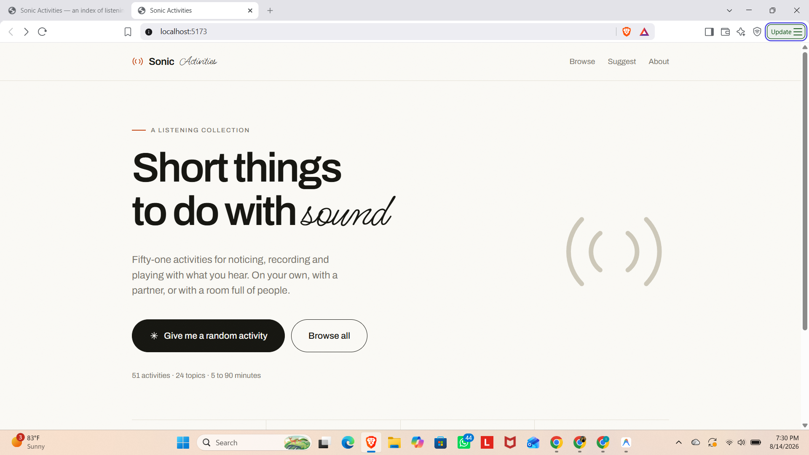
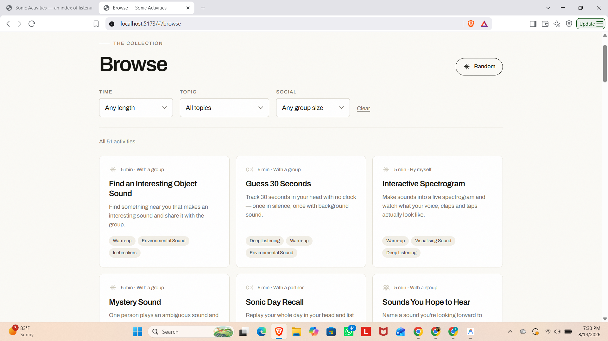
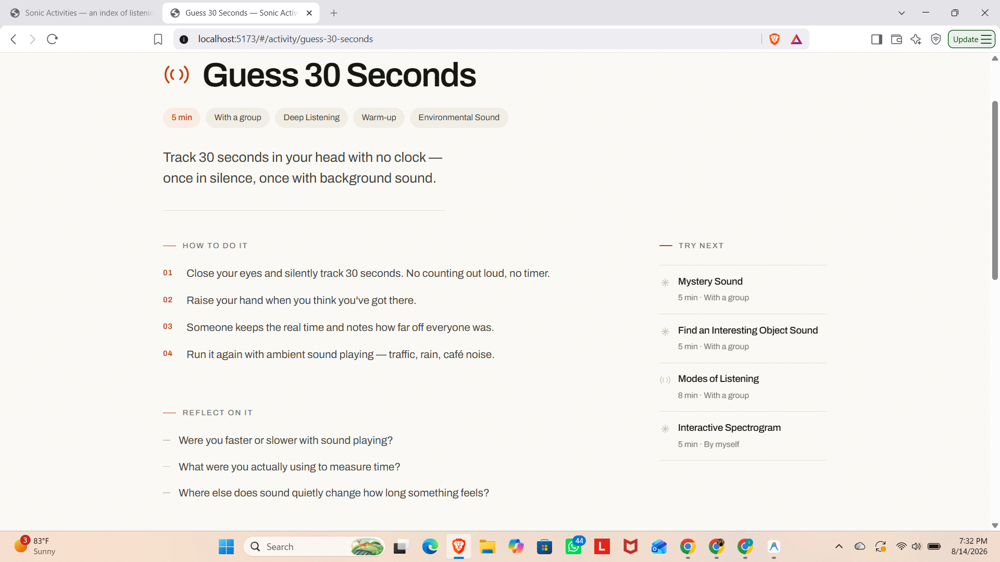

# Sonic Activities

A searchable library of sonic thinking activities, built for the Resonate Data Lab's Sonic Archives project. Sonic Activities helps facilitators and researchers quickly find activities for noticing, recording, and playing with sound, filterable by group size, time, and topic.

Built by Sinthia Rahman Urmi, summer research assistant, Resonate Data Lab, under Prof. Jordan Wirfs-Brock.

## What it does

- 51 activities across 24 topics, ranging from 5 to 90 minutes
- Filter by time available, topic, and social format (by yourself, with a partner, or with a group)
- Each activity has its own page with step-by-step instructions and reflection prompts
- Visitors can add their own responses after trying an activity

## Screenshots

**Homepage**


**Browse and filter view**


**Individual activity page**


## Demo video

[Add link to a short screen recording here once available]

## Background

This project comes out of the Resonate Data Lab's broader question: how can we develop technologies that support people in using sound, as a sensory experience, to understand the world? Sonic Activities was built from roughly 60 activities collected from lab meeting notes and CS301 course materials, organized into thematic categories such as cross-sensory sketching and ideation, find/make a sound, and reflecting on the meaning of sound in your life.

## Running locally

```
git clone https://github.com/Resonate-Data-Lab/sonic-thinking-activities.git
cd sonic-thinking-activities
npm install
npm run dev
```

## Related

Part of the Resonate Data Lab's Sonic Archives project, alongside the lab's Physicalizing Sound project.
